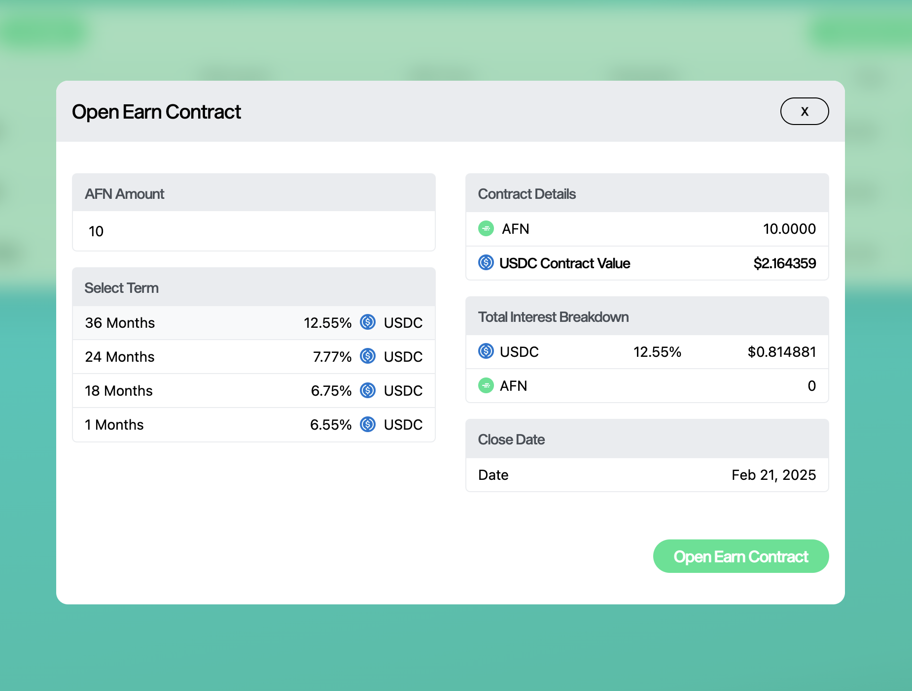

# Understanding Alta Finance Earn

Earn is an Alta Finance feature that lets you loan your crypto via ALTA and earn up to 19.75% APY in USDC—bringing real asset yields to web3.

Earn is currently supported on the following networks:

* Ethereum
* Polygon

### Earn Terms

AltaFin offers 36, 24, 18, and 1 months terms with up to 19.75% APY.

### Earn Tiers

Alta Finance offers three different tiers that will unlock different APYs and ALTA bonuses. These terms are subject to change for new earn contracts.

#### Tier Limits

|          | Low | Medium | High |   |
| -------- | --- | ------ | ---- | - |
| 1-month  |     |        |      |   |
| 18-month |     |        |      |   |
| 24-month |     |        |      |   |
| 36-month |     |        |      |   |

#### ALTA Bonuses

|          | Low | Medium | High |   |
| -------- | --- | ------ | ---- | - |
| 1-month  |     |        |      |   |
| 18-month |     |        |      |   |
| 24-month |     |        |      |   |
| 36-month |     |        |      |   |

### Bonus Interest Rate

Real world assets are illiquid by nature which could delay payments from our side. Though delayed payments are never expected, Alta Finance architected a bonus interest rate for additional compensation to the Earn contract holder should the close out take longer than 7 days after the contract close date.&#x20;

### Start with Alta Finance Earn

[How to open an Earn contract](../tutorials/how-to-open-an-earn-contract.md)

[How to put an Earn contract up for bidding](../tutorials/how-to-put-an-earn-contract-up-for-bidding.md)\

