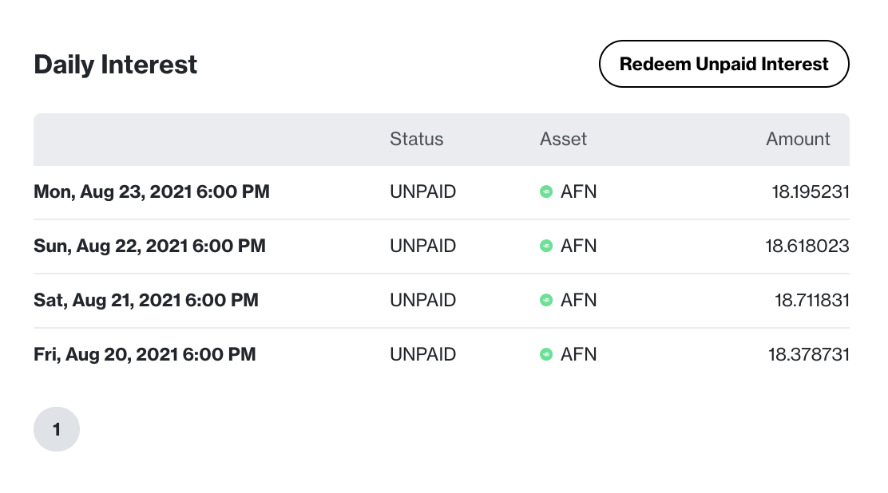

# Understanding AltaFin Earn

Earn is an AltaFin feature that lets you loan your crypto via AFN and earn up to 12% APY in USDC bringing this way the massive wealth gains of real-world assets to the crypto industry.

The interest is calculated daily in a Base and Bonus rate and can be redeemed at the end of the term length chosen by you.

The daily interest is calculated with the following formula: \
&#x20;       USDC Contract Value \* ( APY / 365 )

Currently, AltaFin accepts the following protocols:

* Ethereum
* Polygon

### Earn Terms

AltaFin offers 36, 24, and 18 months terms with up to 12.00% APY.

.png>)

### Earn Tiers

AltaFin offers three different tiers that will unlock different APYs and AFN bonuses.

#### High

You can achieve this tier by investing $100,000

#### Medium

You can achieve this tier by investing $50,000

#### Low

You can achieve this tier by investing $25,000

### Bonus Interest Rate

Real-World Assets are illiquid by nature which could delay payments from our side. Delayed payments may never happen but AltaFin architected a bonus interest rate to compensate for any possible inconvenience.&#x20;

The way the bonus interest works is that, after a seven days buffer, you will get twice as much AFN as you should every day that the payment is delayed.

### Start with AltaFin Earn

[How to open an Earn contract](../tutorials/how-to-open-an-earn-contract.md)

[How to put an Earn contract up for bidding](../tutorials/how-to-put-an-earn-contract-up-for-bidding.md)\

