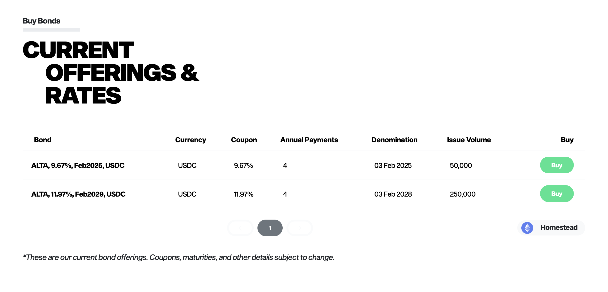
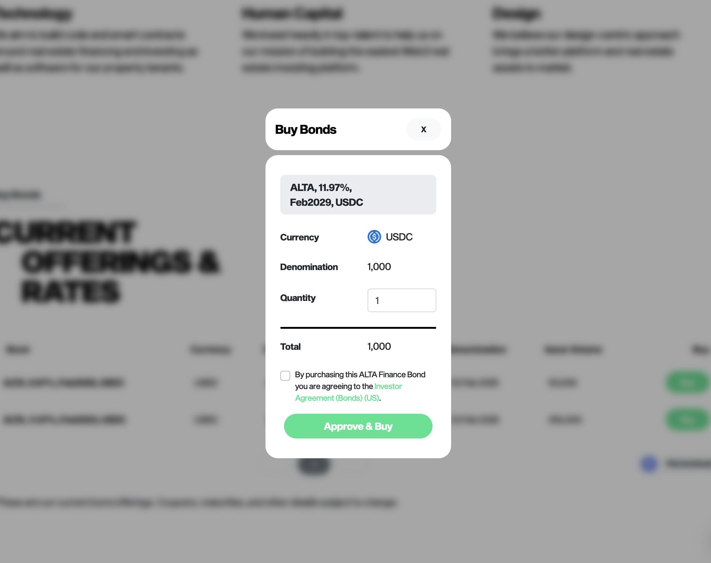
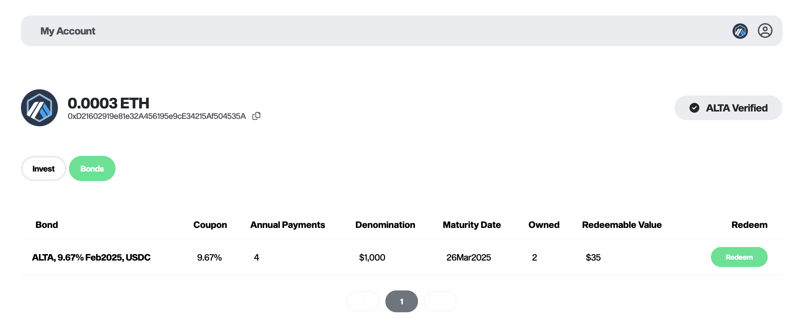

# ALTA Bonds™

## Introducing ALTA Bonds™: Empowering Growth and Investment

### What are ALTA Bonds?

ALTA Bonds are debt instruments utilized by our company to raise funds from investors. These bonds enable us to finance our core business activities and strategic initiatives. Unlike our real estate-specific investments, ALTA Bonds focus on supporting our overall growth and expansion.

### How does it work?

ALTA Bonds function as debt instruments that we offer to investors. Each bond is denominated in 1,000 USDC. Upon reaching the maturity date, we commit to repurchasing the bond from the investor at its face value.

Every bond offering comprises essential details, including the base currency (USDC), the coupon (annual interest rate), the number of annual interest payments, and the maturity date.

Leading up to the maturity date, bond owners have the opportunity to redeem their interest payments in line with the specified number of annual payments for that particular bond. Once the maturity date is reached, bond owners can redeem the unpaid principal by selling back their bond to the company at its face value.

<figure><figcaption></figcaption></figure>

### Purchasing ALTA Bonds

To acquire ALTA Bonds, buyers simply need to connect their Web3 wallet, undergo a one-time ALTA verification process for that wallet, and then click the "Buy" button. Buyers have the flexibility to purchase one or more bonds, depending on their investment preferences and objectives.

<figure><figcaption></figcaption></figure>

### Redeeming Bond Coupons

Redeeming ALTA Bond Coupons is a straightforward process. Simply navigate to the "My Account" section, where you can connect your Web3 wallet securely. Once connected, you will find a list of your associated bonds. To redeem the coupon for a specific bond, just locate the bond in question and click the "Redeem" button.

<figure><figcaption></figcaption></figure>

### Definitions

To ensure clarity and understanding, here are some key terms associated with ALTA Bonds:

**Currency**\
The token accepted for purchasing bonds and used for interest and principal redemptions.

**Coupon**\
The annual interest rate calculated on a simple interest basis.

**Annual Payments**\
The number of times per year that bond owners can redeem their interest payments.

**Maturity Date**\
The specified date when the bond matures and can be resold back to the company at its face value.

**Issue Volume**\
The anticipated total volume of bonds that our company intends to sell. However, the actual volume of bonds issued may vary due to market factors, transaction speeds, and management decisions.

### Smart Contract Addresses

ALTA Bonds smart contracts have been deployed on the following networks:

* Ethereum
* Polygon
* Avalanche
* BNB Smart Chain
* Optimism
* Arbitrum

| Network         | Contract                                   |
| --------------- | ------------------------------------------ |
| Ethereum        | 0x620B1D114cF8697dc6316fFf606D0107d15D2D29 |
| Polygon         | 0x54789baa70C91fB61b950c0E19F91fbcbd95fa5C |
| Avalanche       | 0x383d722b05A314f721E48060965C2E1E161165F5 |
| BNB Smart Chain | 0x9919A695B74A0644cbB3e5e4A65825b972fA138a |
| Optimism        | 0xDcaEAF0EDE230436605118287eD889de2949aF2A |
| Arbitrum        | 0x47976Efd4141348CEFef50c12736f60a88F87F6d |

### Subgraph URL's

| Network         | Subgraph                                                                                                                                                         |
| --------------- | ---------------------------------------------------------------------------------------------------------------------------------------------------------------- |
| Ethereum        | [https://thegraph.com/hosted-service/subgraph/altafinprotocol/bonds](https://thegraph.com/hosted-service/subgraph/altafinprotocol/bonds)                         |
| Polygon         | [https://thegraph.com/hosted-service/subgraph/altafinprotocol/bonds---polygon](https://thegraph.com/hosted-service/subgraph/altafinprotocol/bonds---polygon)     |
| Avalanche       | [https://thegraph.com/hosted-service/subgraph/altafinprotocol/bonds---avalanche](https://thegraph.com/hosted-service/subgraph/altafinprotocol/bonds---avalanche) |
| BNB Smart Chain | [https://thegraph.com/hosted-service/subgraph/altafinprotocol/bonds---binance](https://thegraph.com/hosted-service/subgraph/altafinprotocol/bonds---binance)     |
| Optimism        | [https://thegraph.com/hosted-service/subgraph/altafinprotocol/bonds---optimism](https://thegraph.com/hosted-service/subgraph/altafinprotocol/bonds---optimism)   |
| Arbitrum        | [https://thegraph.com/hosted-service/subgraph/altafinprotocol/bonds---arbitrum](https://thegraph.com/hosted-service/subgraph/altafinprotocol/bonds---arbitrum)   |
