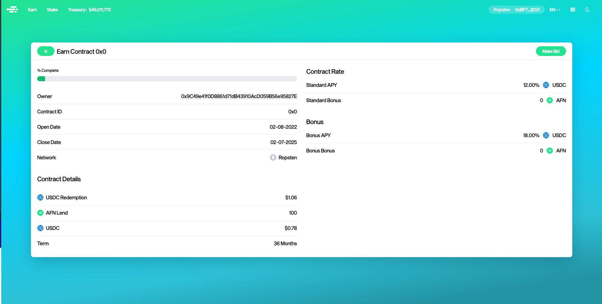
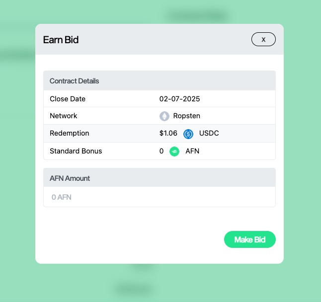

# How to make a bid on an Earn contract

1\. Go to [app.alta.finance/earn](https://app.alta.finance/earn)

2\. Click For Sale

3\. Click on the contract that you want to make a bid on

4\. Click Make Bid

5\. Enter the amount of ALTA that you want to offer

6\. Click Make Bid

7\. Approve the transaction in your wallet
