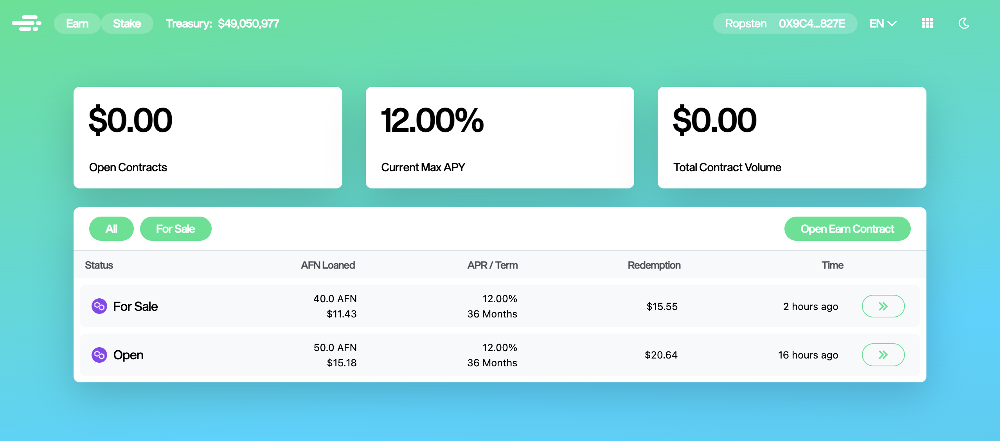
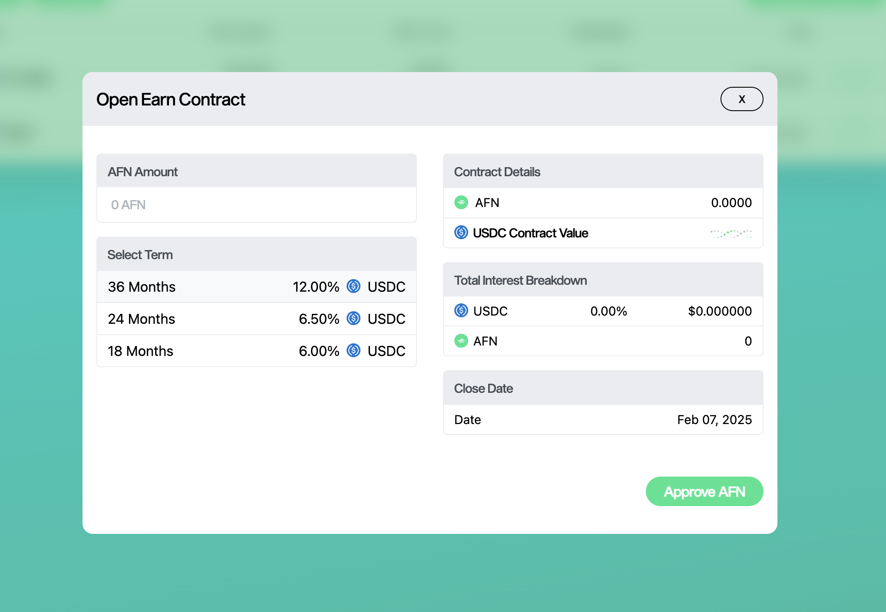
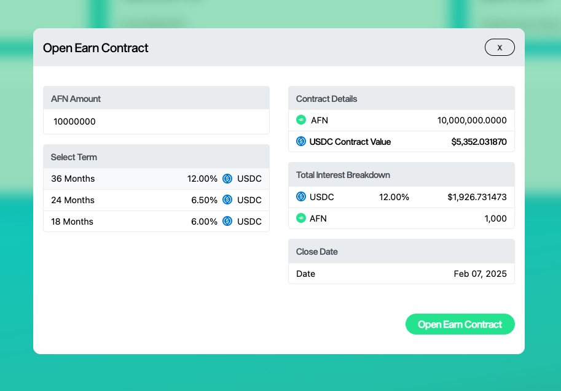
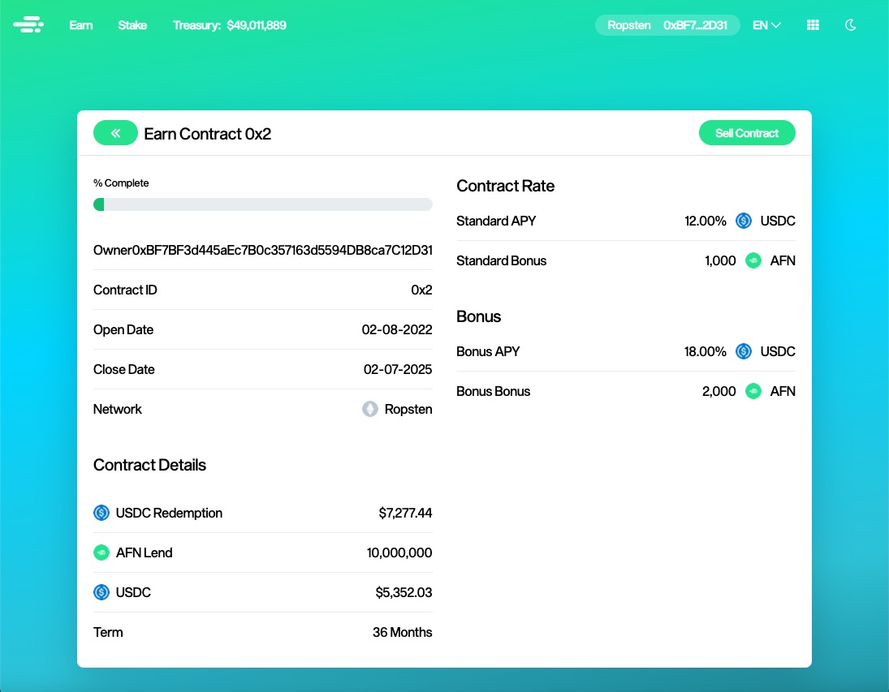

# How to open an Earn contract

AltaFin Earn is a unique feature that brings real-world assets to the crypto and web3 communities.

Opening a contract could be achieved by:

1\. Go to [app.altafin.co/earn](https://app.altafin.co/earn)

2\. Connect your wallet

3\. Click Open Earn Contract

4\.  Click Approve AFN (This will only show up if your wallet is not approved yet)

5\. Enter the AFN Amount that you want to invest

6\. Select the desired term

7\. Click Open Earn Contract

8\. Confirm the transaction in your wallet where the gas fees will be added

9\. You will be taken to the contract dashboard that will contain essential information

From here you can put your contract for bidding or see all the bids that your contract has.

To learn more about bidding go to [How to put an Earn contract up for bidding](how-to-put-an-earn-contract-up-for-bidding.md).
