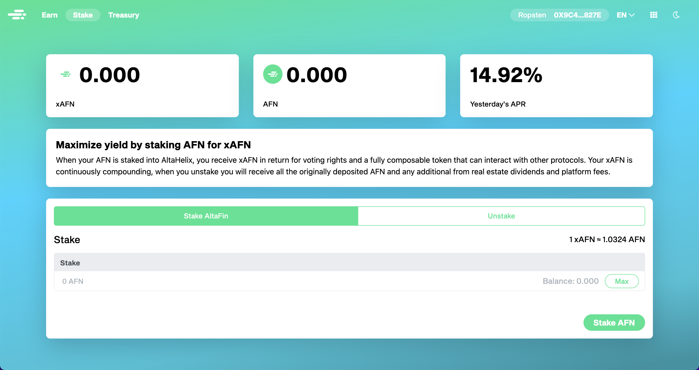

# How to Stake AFN for xAFN

AltaFin not only offers you the opportunity to earn AFN and share in-platform fees and real-estate dividends with your dormant tokens, but you can also earn xAFN tokens from your AFN tokens! Rewards on rewards! All you need are some AFN tokens and some Ethereum (ETH) to get started!&#x20;

### How to Stake

1. Go to [https://app.altafin.co/stake](https://app.altafin.co/stake)
2. Click Connect to Wallet
3. Click Approve
4. Enter the amount of AFN you want to Stake
5. Click Stake AFN
6. Approve the transaction in your wallet

__\
_See a more detailed guide:_\
__To start staking go to [https://app.altafin.co/stake](https://app.altafin.co/stake). Then, click "Connect to Wallet" and choose your preferred crypto wallet. \
Once your wallet is connected, the "Connect to Wallet" button will change to "Approve". Click "Approve" to give Altafin permission to perform transactions with you. Note that if clicking approve doesn't open your wallet, that means that you don't have enough ETH to pay for the gas fees.\
When you approve your wallet, it takes a few seconds for your wallet to make the final approval so a "..." button will show up until your wallet gets approved. \
Once your wallet gets approved, the "..." will change to "Stake AFN".\
Under Stake, enter the amount of AFN that you want to stake and click "Stake AFN."\
Once you click Stake AFN, your wallet will pop up asking to approve that transaction where you will receive xAFN according to the amount of AFN that you provide.

### Official Link

Stake your AFN for xAFN here: [https://app.altafin.co/stake](https://app.altafin.co/stake).
